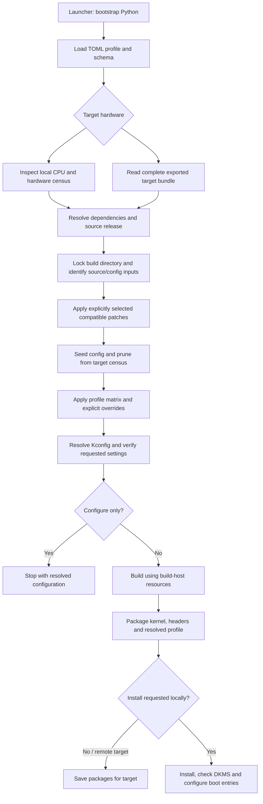

# Kernel build flow

| File | Responsibility |
|---|---|
| `kernel` | Python bootstrap and entry point |
| `dusky_kernal_compile.py` | Hardware discovery, configuration, build and installation orchestration |
| `kernel_profiles/schema.py` | Field defaults, validation and wizard metadata |
| `kernel_profiles/*.toml` | Selectable tuning profiles |
| `patches/*.patch` | Optional source modifications |
| `kernel_profiles/settings/kernel_settings.toml` / `kernel_storage.py` | Machine storage policy and RAM restore/checkpoint handling |
| `kernel_runtime.py` | Optional packaged boot-time settings |
| `tests/test_kernel.py` | Isolated regression checks |

Remote hardware decides the kernel configuration; the build machine decides parallelism. Source/configuration checks precede compilation. Explicit configuration requirements fail when unresolved; dependency-gated preferences are reported separately.

See [usage](README.md), [profile fields](kernel_profiles/_SCHEMA_GUIDE.md), and [audit findings](audit/AUDIT.md). No build-speed, battery-life or boot-success guarantees are implied.
