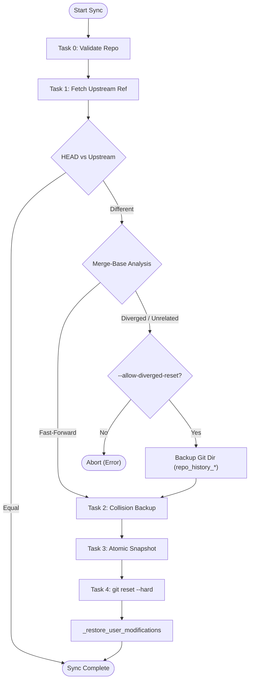
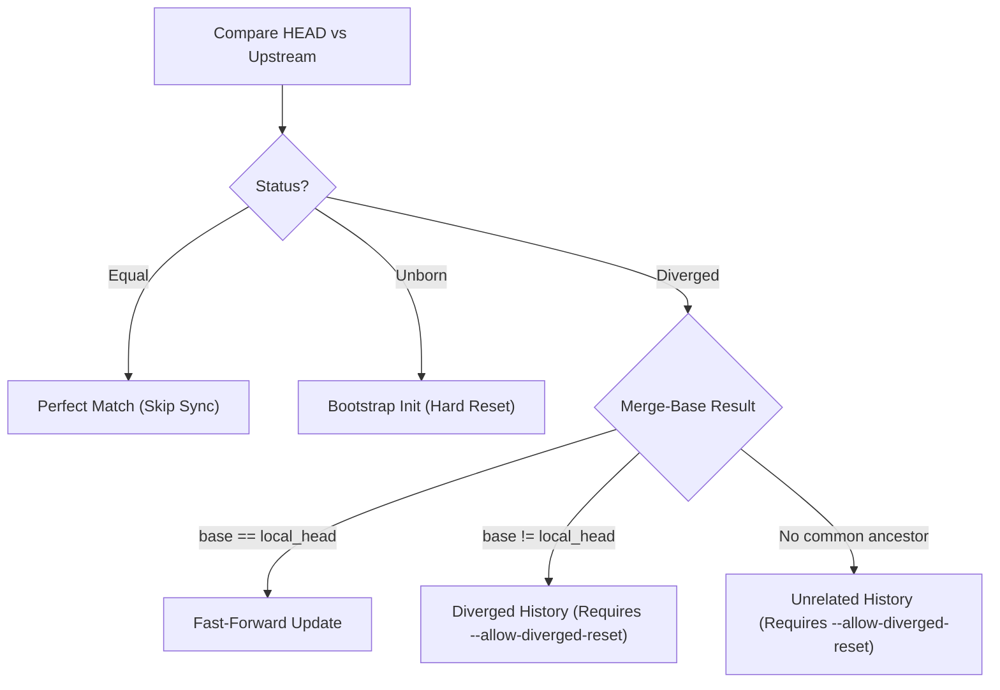
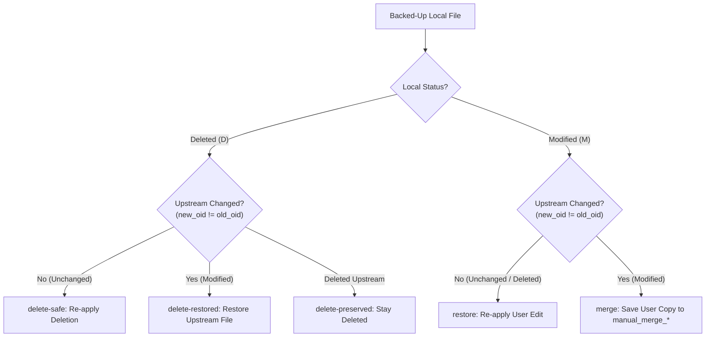

# Dusky Sync & Update Architecture

Reference guide for `update_dusky.py` synchronization mechanics, backup strategies, file restoration algorithms, and `once` execution markers.

---

## 1. Core Mechanics & Repo Layout

- **Work Tree (`WORK_TREE`)**: `~` ([user_home()](file:///home/dusk/user_scripts/update_dusky/python/update_dusky.py#L89))
- **Git Directory (`GIT_DIR`)**: `~/dusky` ([L2314](file:///home/dusk/user_scripts/update_dusky/python/update_dusky.py#L2314)) — Bare repository
- **Upstream Tracking Ref**: `refs/dusky-updater/upstream/<branch>` ([L3368](file:///home/dusk/user_scripts/update_dusky/python/update_dusky.py#L3368))

### The 5 Sync Tasks

| Task | Name | Primary Function | Core Action |
| :---: | :--- | :--- | :--- |
| **0** | **Bare Repo Validation** | `_get_repo_state` | Validates permissions & ownership and bare-repo identity. Refuses on git locks or in-progress merge/rebase (never auto-removes locks). Auto-clones (staged temp dir, published only on success) if absent. |
| **1** | **Fetch & Diff** | `_fetch_with_retry` | Fetches upstream ref, snapshots the target commit OID (`rev-parse <ref>^{commit}` + `cat-file -t`), and uses the OID throughout. Rejects incoming trees overlapping protected storage. |
| **2** | **Collision Backup** | `_backup_worktree_collisions` | Moves colliding paths to `moved_aside_<ts>/payload/` with journal in `.meta/`. Fails closed on `ls-tree`/`ls-files` errors. |
| **3** | **Snapshot** | `_capture_tracked_changes` | Backs up local tracked edits (`diff-index HEAD`, fail-closed) to `your_changes_<ts>/payload/` with manifest in `.meta/` plus staged blobs in `.meta/staged/`. Full snapshots verify every copy and abort reset on omission. |
| **4** | **Reset & Restore** | `_restore_user_modifications` | Runs `git reset --hard <OID>`, gates incoming scripts (preserves deletions, blocks and restores invalid scripts from previous commit), then restores or stages conflicts in `manual_merge_<ts>`. Preserves backups on any uncertainty. |

---

## 2. Sync Pipeline Flow



---

## 3. History Reconciliation & Safety



> [!IMPORTANT]
> **Safety Overrides for Diverged / Unrelated Histories**:
> - Aborts unless `--allow-diverged-reset` is passed ([L3513](file:///home/dusk/user_scripts/update_dusky/python/update_dusky.py#L3513)).
> - Preserves bare repo metadata in `repo_history_<timestamp>` ([L3208](file:///home/dusk/user_scripts/update_dusky/python/update_dusky.py#L3208)).
> - Creates full work-tree snapshot `full_snapshot_<timestamp>` for unrelated histories ([L3157](file:///home/dusk/user_scripts/update_dusky/python/update_dusky.py#L3157)).

---

## 4. File Restoration Decision Matrix

Post-reset, [_restore_user_modifications](file:///home/dusk/user_scripts/update_dusky/python/update_dusky.py#L3253) compares pre-reset state `(old_oid, old_mode)` with new upstream state `(new_oid, new_mode)`:



| Local Status | Upstream State | Action Code | Behavior | Work-Tree Result | Line |
| :---: | :---: | :---: | :--- | :--- | :---: |
| **Deleted** | Unchanged | `delete-safe` | Re-applies local deletion | Deleted | [L3293](file:///home/dusk/user_scripts/update_dusky/python/update_dusky.py#L3293) |
| **Deleted** | Also Deleted | `delete-preserved` | No-op (deleted on both sides) | Deleted | [L3290](file:///home/dusk/user_scripts/update_dusky/python/update_dusky.py#L3290) |
| **Deleted** | Modified | `delete-restored` | **Upstream wins** (overrides deletion) | Upstream file restored | [L3306](file:///home/dusk/user_scripts/update_dusky/python/update_dusky.py#L3306) |
| **Modified** | Unchanged | `restore` | Restores local modification | Local edited file | [L3333](file:///home/dusk/user_scripts/update_dusky/python/update_dusky.py#L3333) |
| **Modified** | Deleted | `restore` | Restores local edit (survives upstream drop) | Local untracked file | [L3285](file:///home/dusk/user_scripts/update_dusky/python/update_dusky.py#L3285) |
| **Modified** | Modified | `merge` | Upstream in work tree; user copy in `manual_merge_*` | Upstream version | [L3310](file:///home/dusk/user_scripts/update_dusky/python/update_dusky.py#L3310) |

---

## 5. Key Edge Cases & Takeaways

> [!WARNING]
> - **Deletion Resurrection**: If you delete a tracked file locally and upstream modifies it, upstream's version is restored (`delete-restored`).
> - **Survival Against Upstream Deletion**: If upstream deletes a file you edited locally, your version survives as an untracked file (`restore`).

- **Untracked Local Files**: Ignored by `reset --hard`. If upstream adds a file at the same path, Task 2 moves untracked path to `moved_aside_<timestamp>`.
- **Local-Only Tracked Files**: Removed by `reset --hard`. Preserved in `full_snapshot_<timestamp>` during unrelated history resets.

---

## 6. Backup Storage Strategy

Backups are saved under `~/Documents/dusky_backups/` (configurable via `paths.backups_subdir`):

| Directory | Created By | Purpose | Retention |
| :--- | :--- | :--- | :--- |
| `moved_aside_<ts>` | Task 2 | Untracked work-tree collisions (`payload/` + `.meta/JOURNAL.txt`, `.meta/STATUS=pending-collision`) | Never auto-pruned; requires explicit user action |
| `your_changes_<ts>` | Task 3 | Pre-reset local tracked edits (`payload/` + `.meta/MANIFEST.txt`, staged blobs in `.meta/staged/`) | Auto-pruned only when `.meta/STATUS=completed` and older than `backup_retention_days`; otherwise preserved |
| `full_snapshot_<ts>` | Task 3 | Full tracked tree snapshot (`payload/` + `.meta/EXPECTED.txt`) | Never auto-pruned; requires explicit user action |
| `repo_history_<ts>` | Task 1 | Copy of `~/dusky` bare repo before diverged reset | Never auto-pruned; requires explicit user action |
| `manual_merge_<ts>` | Task 4 | User versions conflicting with upstream updates | Never auto-pruned; requires explicit user action |
| `quarantined_incoming_<ts>` | Gate | Invalid incoming scripts moved out of the worktree with reasons in `.meta/QUARANTINED.txt` | Never auto-pruned; requires explicit user action |

> The syntax gate fails closed: unreadable trees never read as empty, git
> symlinks (mode 120000) are skipped by policy, and exact paths use
> `:(literal)` pathspecs. Self-update restarts keep the operation lock across
> exec and carry exact git outcomes plus the sudo askpass in a bound
> single-use handoff file (`handoff_<run_id>.json` in the runtime dir);
> no password bytes cross the exec and no singleton diff file is reused.

> Payload/metadata separation: `INFO.txt`, `MANIFEST.txt`, `MOVED_PATHS.txt`, `STATUS`, and journals live under `.meta/`; worktree copies live under `payload/`. Staging is preserved under `.meta/staged/` for recovery but never auto-restored.

> **Intentional staging-restoration policy**: staged (index) content is preserved for manual recovery, never auto-restored. A backup containing any staged blob, mode record (`STAGED_MODES.txt`), or staged deletion (`MANIFEST.txt` `staged:absent`) is retained as `pending-staged` and never marked `completed`, even when worktree bytes happen to match. Byte equality with `WORK_TREE` alone does not prove index mode/type/deletion is preserved.

> **File permissions**: regular-file restores preserve the backed-up file's mode (via `copystat` + `chmod` before atomic `replace`), verified (content/type/mode) before the backup is deleted. `0755`/`0644`, local `chmod` edits, and symlinks (recreated as symlinks, never write-through) are covered. A failed `replace` or verification leaves both the destination and the payload recoverable.

> **Read-only SQLite access**: `StateStore`/`OnceStore` in read-only/dry-run mode connect directly to existing databases with SQLite's `mode=ro` (seeing committed WAL data naturally without copying files or manual sidecar manipulation). When a database does not exist, an in-memory instance is used without mutating the filesystem. Real database errors surface normally.

> **Process lifecycle**: `_terminate_process_group` performs bounded shutdown of the process group (SIGTERM → grace → SIGKILL), ensuring children and spawned descendants do not outlive their tasks. Standard UNIX process group signaling is used directly without slow `/proc` iteration loops. Interactive tasks run with clean terminal restoration.

> **PTY input**: Keystrokes and automated prompts are routed directly and reliably to the active child pseudo-terminal, preserving ordering and interactive control.

> **Restart handoff**: When the updater, profile, or settings change during sync, a simple continuation payload carries the held lock descriptor, acquired sudo capability, and previous git task outcomes across `execv`. The child re-adopts the lock and sudo state without re-prompting or losing exclusivity.

> **UI bootstrap**: no auto-installation. Missing `textual`/`rich` prints an explicit `sudo pacman -S` command and exits before mutations. Info commands and dry-run never install.

> **Child-input keys**: reserved emergency shortcuts are ONLY `Ctrl+O` (leave child-input) and `Ctrl+Q` (emergency abort), both priority bindings. All other keys (Escape `\x1b`, `Ctrl+F`/`Ctrl+L`, function keys, Tab, arrows, printable) are non-priority and reach the child in child-input mode. Unrelated bindings are disabled via `check_action` in child-input mode; modals and `Input` focus are preserved.

---

## 7. Script Execution Markers (`once` System)

The `OnceStore` class ([L797](file:///home/dusk/user_scripts/update_dusky/python/update_dusky.py#L797)) manages execution state using SQLite at `state_dir() / "once.db"` ([L799](file:///home/dusk/user_scripts/update_dusky/python/update_dusky.py#L799)). Unique marker keys are generated via [OnceStore.make_key](file:///home/dusk/user_scripts/update_dusky/python/update_dusky.py#L896) using a 16-byte `BLAKE2b` digest ([L916](file:///home/dusk/user_scripts/update_dusky/python/update_dusky.py#L916)) over key material (`once`, scope, profile, mode, task name, relative path, args).

```mermaid
stateDiagram-v2
    [*] --> Lookup
    Lookup --> Mode{"once_mode?"}
    
    Mode -- "forever" --> Skip["Action: skip (Never re-runs)"]
    Mode -- "sealed" --> SealedCheck{"Checksum modified?"}
    SealedCheck -- "No" --> Skip
    SealedCheck -- "Yes" --> Notify["Action: notify_sealed (Warn & Skip)"]
    
    Mode -- "content (default)" --> ContentCheck{"Checksum matches?"}
    ContentCheck -- "Match" --> Skip
    ContentCheck -- "Changed" --> Run["Action: run (Re-executes)"]
```

---

## 8. CLI Flags Summary

| Flag / Setting | Scope | Effect |
| :--- | :--- | :--- |
| `--allow-diverged-reset` | Sync Phase | Allows hard reset on diverged or unrelated history ([L3513](file:///home/dusk/user_scripts/update_dusky/python/update_dusky.py#L3513)). |
| `--skip-sync` | Entrypoint | Bypasses `GitEngine.execute_phase` completely. |
| `status.showUntrackedFiles` | Git Config | Set to `no` automatically by `_ensure_repo_defaults()` ([L2860](file:///home/dusk/user_scripts/update_dusky/python/update_dusky.py#L2860)). |
